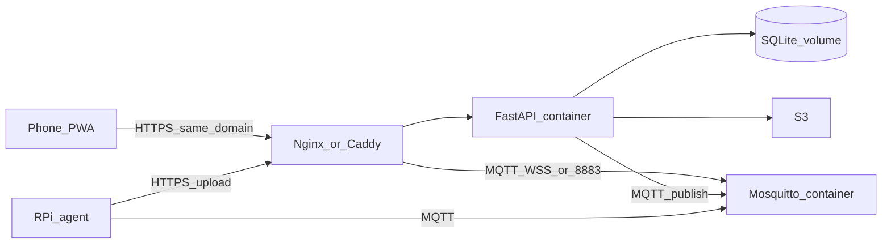

name: rpi capture app
overview: "Smart Shelf Monitor — Dockerized FastAPI+SQLite+Mosquitto on a custom domain, multi-Pi PWA with passkey cookie auth, MQTT control, S3 history, fixed-hotspot Pi agent, and WiFi SSID reconfig from the UI."
todos:
  - id: docker-stack
    content: "docker-compose — FastAPI app (SQLite volume), Mosquitto, reverse-proxy routing same domain; .env.example for S3, passkeys, MQTT, seed devices."
    status: pending
  - id: db-auth
    content: "SQLite schema + migration seeding devices and passkeys from env; HTTP-only cookie session (7 days)."
    status: pending
  - id: server-api
    content: "FastAPI — auth, devices list/status, capture via MQTT, upload→S3, per-device history, WiFi reconfig API."
    status: pending
  - id: mqtt
    content: "Mosquitto in compose; topics for presence, capture cmd, wifi reconfig; LWT offline."
    status: pending
  - id: pi-agent
    content: "Pi agent — fixed SSID/pass from .env, nmcli rescan/connect every 2s until online, MQTT presence, capture+upload, apply WiFi reconfig from MQTT."
    status: pending
  - id: pwa-ui
    content: "PWA — login, bento cards (History button), device detail (viewfinder+timestamp, Capture, Close, History table), WiFi reconfig UI, light bluish professional styles."
    status: pending
  - id: docs
    content: "README — EC2 domain deploy, .env, migrations/device seed, Pi .env + systemd, Mosquitto/nginx paths."
    status: pending
isProject: false
---

# Smart Shelf Monitor — locked plan

## Product

**Smart Shelf Monitor** — PWA + Docker backend on your existing custom domain. Multiple pre-seeded Raspberry Pis appear as bento cards. Capture over MQTT; images stored in S3; history per device; WiFi hotspot credentials reconfigurable from the UI.

## Locked decisions

| Topic | Choice |
|-------|--------|
| Hosting | Existing EC2 + custom domain |
| Backend | Docker (compose): FastAPI app + SQLite volume + Mosquitto; same domain for API, PWA, MQTT |
| DB | SQLite inside backend container (persistent volume) |
| Secrets | `.env` — S3 key/secret/bucket, passkeys, MQTT creds, etc. |
| Devices | Pre-seeded via migration (documented in README) |
| Control plane | MQTT (commands + presence + WiFi reconfig) |
| Images | HTTPS upload → S3; keep all; never MQTT for JPEG |
| Auth | Passkey(s) from `.env`; HTTP-only cookie; **7-day** expiry |
| WiFi (Pi) | Fixed SSID+password from Pi `.env`; `nmcli` wifi rescan/connect loop every **2s** until connected |
| Card button | Labeled **History** → past captures for that device |
| Viewfinder | Last captured image for device + **timestamp on top**; blank if none yet |
| History | Per device only |
| SSID reconfig | **In scope** — from UI (see below) |

## Architecture

### Docker compose (intended)

- `api` — FastAPI + static PWA; SQLite at `/data/app.db` (volume).
- `mosquitto` — broker; credentials from `.env`.
- `proxy` (or host nginx you already use) — TLS on custom domain:
  - `/` → PWA + API
  - MQTT: prefer **MQTT over WebSocket** on `wss://domain/mqtt` (easy through same HTTPS) **or** TCP `8883` if you open that port — default plan: **MQTT over WSS under same domain** so one TLS cert covers everything.

### Image vs MQTT

- MQTT: presence, capture command, WiFi reconfig payload, optional `capture_done`.
- HTTP: Pi multipart upload → API puts object in S3 + inserts `captures` row.

## UI

### Login
- Passkey field; validate against seeded passkey hash(es) from `.env` / migration.
- Set HTTP-only secure cookie; 7 days.

### Home — bento grid
- Card per device: **name**, green/red LED (MQTT online), **History** button (opens history for that device).
- Clicking the card body → device detail (capture screen).

### Device detail
- Hero **viewfinder**: last image for that device; **timestamp** above/on the frame; empty state if never captured.
- Controls: **Capture** (disabled if offline), **Close**, **History**.
- **WiFi settings** (SSID reconfig): form to set hotspot SSID + password for this device → saved in DB → pushed to Pi over MQTT → Pi applies via `nmcli` and reconnects.

### History
- Per-device table: timestamp + open/thumbnail; backed by S3 keys in DB.

### Visual
- Light mode, minimalist, professional; bluish accents + subtle gradient; buttons with clear color pop.

## Data model

- `passkeys` — hashed values seeded from `PASSKEYS` (or similar) in `.env` at migrate time.
- `devices` — `id`, `device_key` (MQTT client id / upload auth), `name`, `wifi_ssid`, `wifi_password` (current desired hotspot), `created_at`.
- `captures` — `id`, `device_id`, `s3_key`, `job_id`, `created_at`.
- Presence: in-memory / Redis-less cache from MQTT status + LWT (optional `last_seen` column updated on heartbeat).

## MQTT topics

- `shelf/{device_key}/status` — Pi → online/heartbeat JSON; LWT offline.
- `shelf/{device_key}/cmd` — server → `{"cmd":"capture","job":"<uuid>"}`.
- `shelf/{device_key}/wifi` — server → `{"ssid":"...","password":"..."}` on reconfig.
- `shelf/{device_key}/event` — optional ack (`capture_done`, `wifi_applied`).

## Pi agent

Loop:

1. Every **2 seconds**: `nmcli device wifi rescan` (best-effort) + attempt connect to **current** SSID/password (from local `.env` initially; updated when MQTT `wifi` message received and persisted locally).
2. When internet OK (e.g. Google `generate_204`): connect MQTT with LWT; publish online; subscribe `cmd` + `wifi`.
3. On `capture`: JPEG via `picamera2` → save on disk → `POST /api/devices/{device_key}/upload` with device token → optional event.
4. On `wifi`: update local creds file, `nmcli` connect to new SSID, republish status when back online.
5. Reconnect MQTT with backoff if broker drops.

Keep [`wifi_qr_provision.py`](wifi_qr_provision.py) as reference only; new agent file is the runtime path (no QR in v1).

## Server API (sketch)

- `POST /api/auth/login` / `POST /api/auth/logout`
- `GET /api/devices` — names + online + latest capture meta
- `GET /api/devices/{id}`
- `POST /api/devices/{id}/capture`
- `POST /api/devices/{device_key}/upload` — Pi auth via device token
- `GET /api/devices/{id}/latest` — image URL (presigned) + timestamp
- `GET /api/devices/{id}/history`
- `PUT /api/devices/{id}/wifi` — `{ssid, password}` → DB + MQTT publish

## Config (`.env` on server)

Documented in README / `.env.example`:

- `PASSKEYS=362016` (comma-separated if multiple)
- `SESSION_SECRET=...`
- `S3_ACCESS_KEY`, `S3_SECRET_KEY`, `S3_BUCKET`, `S3_REGION`, optional `S3_PREFIX`
- `MQTT_USER`, `MQTT_PASSWORD`
- `DEVICE_SEED` or SQL migration listing `device_key`, `name`, initial wifi (optional)

Pi `.env`: `DEVICE_KEY`, `DEVICE_TOKEN`, `MQTT_URL`, `API_URL`, `WIFI_SSID`, `WIFI_PASSWORD`.

## README must cover

- Clone + fill `.env`
- `docker compose up`
- How migration seeds passkeys + devices (edit seed list before first boot)
- Domain / TLS routing for API + MQTT WSS
- Pi agent install, `.env`, systemd service
- nmcli privileges note

## Still confirm (small)

1. **MQTT through same domain**: OK to use **MQTT over WebSocket** at `wss://your.domain/mqtt` (fits one Docker+TLS setup), or do you require native MQTT TCP port `8883`?
2. **SSID reconfig UX**: settings panel on **device detail** only — enough?
3. **Device seed**: paste the initial list you want in migration (e.g. `shelf-01 / Smart Shelf 1`, …) when you have it — placeholders `shelf-01`, `shelf-02` in README until then.
4. **S3 image delivery to PWA**: **presigned GET URLs** (default) OK?